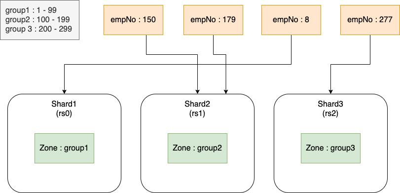

# Shard 제거 테스트

- [Shard 제거 테스트](#shard-제거-테스트)
  - [Shard Zone 설정](#shard-zone-설정)
  - [Shard 데이터 분산 저장](#shard-데이터-분산-저장)
  - [Shard 제거](#shard-제거)
    - [1. Balancer가 활성화 되어있는지 확인](#1-balancer가-활성화-되어있는지-확인)
    - [2. 제거할 shard(rs0) 확인](#2-제거할-shardrs0-확인)
    - [3. shard에서 chunk 제거](#3-shard에서-chunk-제거)
    - [4. chunk migration(remaining) 상태 확인](#4-chunk-migrationremaining-상태-확인)
      - [remaining.chunk 상세 확인](#remainingchunk-상세-확인)
      - [chunk migration 수동 수행](#chunk-migration-수동-수행)
      - [다른 shard에 rs0의 zone 추가](#다른-shard에-rs0의-zone-추가)
    - [5. primary shard 재지정](#5-primary-shard-재지정)
      - [이동이 발생한 데이터 cache flush](#이동이-발생한-데이터-cache-flush)
    - [6. shard 제거 확인](#6-shard-제거-확인)

## Shard Zone 설정

<p align="center">
  
</p>

```
# 데이터베이스 선택
use ilsa
 
# mongoDB는 자동으로 sharding 되지 않는다
# 데이터베이스에 대해 sharding 활성화
sh.enableSharding("ilsa")
 
# shard 상태 확인
sh.status()
--- Sharding Status ---
  sharding version: {
  	"_id" : 1,
  	"minCompatibleVersion" : 5,
  	"currentVersion" : 6,
  	"clusterId" : ObjectId("609ffcafea5d4851b2e3d86b")
  }
  shards:
        {  "_id" : "rs0",  "host" : "rs0/mongosh0-0.mongosh0-svc.default.svc.cluster.local:27017,mongosh0-1.mongosh0-svc.default.svc.cluster.local:27017,mongosh0-2.mongosh0-svc.default.svc.cluster.local:27017",  "state" : 1 }
        {  "_id" : "rs1",  "host" : "rs1/mongosh1-0.mongosh1-svc.default.svc.cluster.local:27017,mongosh1-1.mongosh1-svc.default.svc.cluster.local:27017,mongosh1-2.mongosh1-svc.default.svc.cluster.local:27017",  "state" : 1 }
        {  "_id" : "rs2",  "host" : "rs2/mongosh2-0.mongosh2-svc.default.svc.cluster.local:27017,mongosh2-1.mongosh2-svc.default.svc.cluster.local:27017,mongosh2-2.mongosh2-svc.default.svc.cluster.local:27017",  "state" : 1 }
  active mongoses:
        "4.2.14" : 1
  autosplit:
        Currently enabled: yes
  balancer:
        Currently enabled:  yes
        Currently running:  no
        Failed balancer rounds in last 5 attempts:  0
        Migration Results for the last 24 hours:
                No recent migrations
  databases:
        {  "_id" : "config",  "primary" : "config",  "partitioned" : true }
        {  "_id" : "ilsa",  "primary" : "rs0",  "partitioned" : true,  "version" : {  "uuid" : UUID("dc3d2ced-e089-4af2-b162-175bf150e92c"),  "lastMod" : 1 } }
 
# 테이블 생성
db.createCollection("emp")
 
# shard key에 대한 오름차순 인덱스 생성
db.emp.createIndex({emp_no: 1})
 
# shard key 지정
sh.shardCollection("ilsa.emp", { emp_no: 1})

# shard 상태 확인
sh.status()
--- Sharding Status ---
  sharding version: {
  	"_id" : 1,
  	"minCompatibleVersion" : 5,
  	"currentVersion" : 6,
  	"clusterId" : ObjectId("609ffcafea5d4851b2e3d86b")
  }
  shards:
        {  "_id" : "rs0",  "host" : "rs0/mongosh0-0.mongosh0-svc.default.svc.cluster.local:27017,mongosh0-1.mongosh0-svc.default.svc.cluster.local:27017,mongosh0-2.mongosh0-svc.default.svc.cluster.local:27017",  "state" : 1 }
        {  "_id" : "rs1",  "host" : "rs1/mongosh1-0.mongosh1-svc.default.svc.cluster.local:27017,mongosh1-1.mongosh1-svc.default.svc.cluster.local:27017,mongosh1-2.mongosh1-svc.default.svc.cluster.local:27017",  "state" : 1 }
        {  "_id" : "rs2",  "host" : "rs2/mongosh2-0.mongosh2-svc.default.svc.cluster.local:27017,mongosh2-1.mongosh2-svc.default.svc.cluster.local:27017,mongosh2-2.mongosh2-svc.default.svc.cluster.local:27017",  "state" : 1 }
  active mongoses:
        "4.2.14" : 1
  autosplit:
        Currently enabled: yes
  balancer:
        Currently enabled:  yes
        Currently running:  no
        Failed balancer rounds in last 5 attempts:  0
        Migration Results for the last 24 hours:
                No recent migrations
  databases:
        {  "_id" : "config",  "primary" : "config",  "partitioned" : true }
        {  "_id" : "ilsa",  "primary" : "rs0",  "partitioned" : true,  "version" : {  "uuid" : UUID("dc3d2ced-e089-4af2-b162-175bf150e92c"),  "lastMod" : 1 } }
                ilsa.emp
                        shard key: { "emp_no" : 1 }
                        unique: false
                        balancing: true
                        chunks:
                                rs0	1
                        { "emp_no" : { "$minKey" : 1 } } -->> { "emp_no" : { "$maxKey" : 1 } } on : rs0 Timestamp(1, 0)
 
# shard Zone Tag 설정
sh.addShardTag("rs0", "group1")
sh.addShardTag("rs1", "group2")
sh.addShardTag("rs2", "group3")
 
# shard Zone 범위 설정
sh.addTagRange("ilsa.emp", {emp_no: 1}, {emp_no: 100}, "group1")
sh.addTagRange("ilsa.emp", {emp_no: 100}, {emp_no: 200}, "group2")
sh.addTagRange("ilsa.emp", {emp_no: 200}, {emp_no: 300}, "group3")

# shard 상태 확인
sh.status()
--- Sharding Status ---
  sharding version: {
  	"_id" : 1,
  	"minCompatibleVersion" : 5,
  	"currentVersion" : 6,
  	"clusterId" : ObjectId("609ffcafea5d4851b2e3d86b")
  }
  shards:
        {  "_id" : "rs0",  "host" : "rs0/mongosh0-0.mongosh0-svc.default.svc.cluster.local:27017,mongosh0-1.mongosh0-svc.default.svc.cluster.local:27017,mongosh0-2.mongosh0-svc.default.svc.cluster.local:27017",  "state" : 1,  "tags" : [ "group1" ] }
        {  "_id" : "rs1",  "host" : "rs1/mongosh1-0.mongosh1-svc.default.svc.cluster.local:27017,mongosh1-1.mongosh1-svc.default.svc.cluster.local:27017,mongosh1-2.mongosh1-svc.default.svc.cluster.local:27017",  "state" : 1,  "tags" : [ "group2" ] }
        {  "_id" : "rs2",  "host" : "rs2/mongosh2-0.mongosh2-svc.default.svc.cluster.local:27017,mongosh2-1.mongosh2-svc.default.svc.cluster.local:27017,mongosh2-2.mongosh2-svc.default.svc.cluster.local:27017",  "state" : 1,  "tags" : [ "group3" ] }
  active mongoses:
        "4.2.14" : 1
  autosplit:
        Currently enabled: yes
  balancer:
        Currently enabled:  yes
        Currently running:  no
        Failed balancer rounds in last 5 attempts:  0
        Migration Results for the last 24 hours:
                1 : Success
  databases:
        {  "_id" : "config",  "primary" : "config",  "partitioned" : true }
        {  "_id" : "ilsa",  "primary" : "rs0",  "partitioned" : true,  "version" : {  "uuid" : UUID("dc3d2ced-e089-4af2-b162-175bf150e92c"),  "lastMod" : 1 } }
                ilsa.emp
                        shard key: { "emp_no" : 1 }
                        unique: false
                        balancing: true
                        chunks:
                                rs0	2
                                rs2	1
                        { "emp_no" : { "$minKey" : 1 } } -->> { "emp_no" : 1 } on : rs2 Timestamp(2, 0)
                        { "emp_no" : 1 } -->> { "emp_no" : 100 } on : rs0 Timestamp(2, 1)
                        { "emp_no" : 100 } -->> { "emp_no" : { "$maxKey" : 1 } } on : rs0 Timestamp(1, 3)
                         tag: group1  { "emp_no" : 1 } -->> { "emp_no" : 100 }
                         tag: group2  { "emp_no" : 100 } -->> { "emp_no" : 200 }
                         tag: group3  { "emp_no" : 200 } -->> { "emp_no" : 300 }
```

## Shard 데이터 분산 저장

데이터 삽입

```
for (i = 1; i < 300; i++) { db.emp.insert({name:"hello", emp_no:i , create_at:new Date()}) }
```

데이터 분포 확인

```
db.emp.getShardDistribution()

Shard rs0 at rs0/mongosh0-0.mongosh0-svc.default.svc.cluster.local:27017,mongosh0-1.mongosh0-svc.default.svc.cluster.local:27017,mongosh0-2.mongosh0-svc.default.svc.cluster.local:27017
 data : 7KiB docs : 99 chunks : 2
 estimated data per chunk : 3KiB
 estimated docs per chunk : 49

Shard rs1 at rs1/mongosh1-0.mongosh1-svc.default.svc.cluster.local:27017,mongosh1-1.mongosh1-svc.default.svc.cluster.local:27017,mongosh1-2.mongosh1-svc.default.svc.cluster.local:27017
 data : 7KiB docs : 100 chunks : 1
 estimated data per chunk : 7KiB
 estimated docs per chunk : 100

Shard rs2 at rs2/mongosh2-0.mongosh2-svc.default.svc.cluster.local:27017,mongosh2-1.mongosh2-svc.default.svc.cluster.local:27017,mongosh2-2.mongosh2-svc.default.svc.cluster.local:27017
 data : 7KiB docs : 100 chunks : 2
 estimated data per chunk : 3KiB
 estimated docs per chunk : 50

Totals
 data : 21KiB docs : 299 chunks : 5
 Shard rs0 contains 33.11% data, 33.11% docs in cluster, avg obj size on shard : 73B
 Shard rs1 contains 33.44% data, 33.44% docs in cluster, avg obj size on shard : 73B
 Shard rs2 contains 33.44% data, 33.44% docs in cluster, avg obj size on shard : 73B
```

데이터 건수 확인

```
db.emp.aggregate( [{ $count: "myCount" }])
{ "myCount" : 299 }
```

## Shard 제거

[Remove Shards from an Existing Sharded Cluster](https://docs.mongodb.com/v4.2/tutorial/remove-shards-from-cluster/)

### 1. Balancer가 활성화 되어있는지 확인

```
sh.status()
...
balancer:
        Currently enabled:  yes
        Currently running:  no
```

```
sh.getBalancerState()
true
```

### 2. 제거할 shard(rs0) 확인

현재 rs0에는 915개의 chunk가 존재하며, 그 중 2개의 chunk가 ilsa.emp에 해당한다.  
또한 rs0는 ilsa.emp의 primary shard이다.

`primary shard`란?
> database 마다 primary shard가 존재하며, database에서 **sharding 되지 않은 데이터**가 저장된다. 즉, ilsa.emp에서 zone에 해당하지 않는 emp_no가 있을 경우 primary shard에 저장된다.

```
sh.status()
...
  databases:
        {  "_id" : "config",  "primary" : "config",  "partitioned" : true }
                config.system.sessions
                        shard key: { "_id" : 1 }
                        unique: false
                        balancing: true
                        chunks:
                                rs0	915
                                rs1	54
                                rs2	55
                        too many chunks to print, use verbose if you want to force print
        {  "_id" : "ilsa",  "primary" : "rs0",  "partitioned" : true,  "version" : {  "uuid" : UUID("dc3d2ced-e089-4af2-b162-175bf150e92c"),  "lastMod" : 1 } }
                ilsa.emp
                        shard key: { "emp_no" : 1 }
                        unique: false
                        balancing: true
                        chunks:
                                rs0	2
                                rs1	1
                                rs2	2
                        { "emp_no" : { "$minKey" : 1 } } -->> { "emp_no" : 1 } on : rs2 Timestamp(2, 0)
                        { "emp_no" : 1 } -->> { "emp_no" : 100 } on : rs0 Timestamp(4, 1)
                        { "emp_no" : 100 } -->> { "emp_no" : 200 } on : rs1 Timestamp(3, 0)
                        { "emp_no" : 200 } -->> { "emp_no" : 300 } on : rs2 Timestamp(4, 0)
                        { "emp_no" : 300 } -->> { "emp_no" : { "$maxKey" : 1 } } on : rs0 Timestamp(2, 4)
                         tag: group1  { "emp_no" : 1 } -->> { "emp_no" : 100 }
                         tag: group2  { "emp_no" : 100 } -->> { "emp_no" : 200 }
                         tag: group3  { "emp_no" : 200 } -->> { "emp_no" : 300 }
```


### 3. shard에서 chunk 제거

```
use admin
db.runCommand( { removeShard: "rs0" } )
{
	"msg" : "draining started successfully",
	"state" : "started",
	"shard" : "rs0",
	"note" : "you need to drop or movePrimary these databases",
	"dbsToMove" : [
		"ilsa"
	],
	"ok" : 1,
    ...
}
```

- balancer가 다른 shard로 chunk migration한다.
- chunk migration은 전체 클러스터에 과도한 부하를주지 않도록 느리게 진행된다.
- 네트워크와 데이터 양에 따라 완료되는데 몇분에서 몇일이 걸릴 수 있다.


### 4. chunk migration(remaining) 상태 확인 

|항목|의미|
|:--|:--|
|chunks|shard에 남아있는 chunk 수|
|dbs|제거되는 shard가 prinary shard인 데이터베이스|
|jumboChunks|shard에 남아있는 jumbo chunk 수|

`jumbo chunk`란?

> 설정된 chunksize 보다 커졌지만 더이상 쪼개질 수 없는 chunk. 대표적인 사례는 단일 shard key를 사용하는 경우이다. 특정 chunk에만 부하가 몰리면 성능 병목현상이 발생할 수 있다.

- remaining.chunks가 `0`이면 끝난다.


```
db.runCommand( { removeShard: "rs0" } )
{
	"msg" : "draining ongoing",
	"state" : "ongoing",
	"remaining" : {
		"chunks" : NumberLong(341),
		"dbs" : NumberLong(1),
		"jumboChunks" : NumberLong(0)
	},
	"note" : "you need to drop or movePrimary these databases",
	"dbsToMove" : [
		"ilsa"
	],
    "ok" : 1,
    ...
}

...

db.runCommand( { removeShard: "rs0" } )
{
	"msg" : "draining ongoing",
	"state" : "ongoing",
	"remaining" : {
		"chunks" : NumberLong(1),
		"dbs" : NumberLong(1),
		"jumboChunks" : NumberLong(0)
	},
	"note" : "you need to drop or movePrimary these databases",
	"dbsToMove" : [
		"ilsa"
	],
    "ok" : 1,
    ...
}
```

> 이상하게 아무리 기다려도 remaining.chunks가 1이 남아있다.

#### remaining.chunk 상세 확인

- config.system.sessions chunks을 확인하면 rs0이 없어졌다.
- ilsa.emp chunks을 확인하면 rs0에 1이 남아있다.

```
sh.status()
...
databases:
    {  "_id" : "config",  "primary" : "config",  "partitioned" : true }
            config.system.sessions
                    shard key: { "_id" : 1 }
                    unique: false
                    balancing: true
                    chunks:
                            rs1	512
                            rs2	512
                    too many chunks to print, use verbose if you want to force print
    {  "_id" : "ilsa",  "primary" : "rs0",  "partitioned" : true,  "version" : {  "uuid" : UUID("dc3d2ced-e089-4af2-b162-175bf150e92c"),  "lastMod" : 1 } }
            ilsa.emp
                    shard key: { "emp_no" : 1 }
                    unique: false
                    balancing: true
                    chunks:
                            rs0	1
                            rs1	2
                            rs2	2
                    { "emp_no" : { "$minKey" : 1 } } -->> { "emp_no" : 1 } on : rs2 Timestamp(2, 0)
                    { "emp_no" : 1 } -->> { "emp_no" : 100 } on : rs0 Timestamp(5, 1)
                    { "emp_no" : 100 } -->> { "emp_no" : 200 } on : rs1 Timestamp(3, 0)
                    { "emp_no" : 200 } -->> { "emp_no" : 300 } on : rs2 Timestamp(4, 0)
                    { "emp_no" : 300 } -->> { "emp_no" : { "$maxKey" : 1 } } on : rs1 Timestamp(5, 0)
                        tag: group1  { "emp_no" : 1 } -->> { "emp_no" : 100 }
                        tag: group2  { "emp_no" : 100 } -->> { "emp_no" : 200 }
                        tag: group3  { "emp_no" : 200 } -->> { "emp_no" : 300 }
```


```
use config
db.chunks.find({shard:"rs0", ns:"ilsa.emp"}).pretty()
{
	"_id" : "ilsa.emp-emp_no_1.0",
	"lastmod" : Timestamp(5, 1),
	"lastmodEpoch" : ObjectId("609ffd8a66bd69421c0323b6"),
	"ns" : "ilsa.emp",
	"min" : {
		"emp_no" : 1
	},
	"max" : {
		"emp_no" : 100
	},
	"shard" : "rs0",
	"jumbo" : false,
	"history" : [
		{
			"validAfter" : Timestamp(1621097866, 3),
			"shard" : "rs0"
		}
	]
}
```


#### chunk migration 수동 수행

`왜 emp_no 99는 안되고, 100은 될까?`

> chunk 범위는 **min(1) <= x < max(100)** 로 100의 경우 zone group1에 속하지 않기 때문에 명령어가 성공한다.   
> 결과적으로 rs0에 있던 데이터들이 다른 shard로 migration 되기엔 zone 조건을 만족하지 못한다.

```
mongos> sh.moveChunk("ilsa.emp",{ emp_no : 99} ,"rs1")
{
	"ok" : 0,
	"errmsg" : "rs1 is not in the correct zone group3",
	"code" : 20,
	"codeName" : "IllegalOperation",
    ...
}
mongos> sh.moveChunk("ilsa.emp",{ emp_no : 100} ,"rs1")
{
	"millis" : 30,
	"ok" : 1,
	...
}
```

#### 다른 shard에 rs0의 zone 추가

rs1에 group1 zone을 추가하면 rs0에 남아있던 chunk가 rs1으로 이동하게 된다.   
**(remaining.chunk = 0)**

```
sh.addShardTag("rs1", "group1")
```

(before)

```
ilsa.emp
    shard key: { "emp_no" : 1 }
    unique: false
    balancing: true
    chunks:
            rs0	1
            rs1	2
            rs2	2
    { "emp_no" : { "$minKey" : 1 } } -->> { "emp_no" : 1 } on : rs2 Timestamp(2, 0)
    -----------------------------------------------------------------
    { "emp_no" : 1 } -->> { "emp_no" : 100 } on : rs0 Timestamp(5, 1)
    -----------------------------------------------------------------
    { "emp_no" : 100 } -->> { "emp_no" : 200 } on : rs1 Timestamp(3, 0)
    { "emp_no" : 200 } -->> { "emp_no" : 300 } on : rs2 Timestamp(4, 0)
    { "emp_no" : 300 } -->> { "emp_no" : { "$maxKey" : 1 } } on : rs1 Timestamp(5, 0)
        tag: group1  { "emp_no" : 1 } -->> { "emp_no" : 100 }
        tag: group2  { "emp_no" : 100 } -->> { "emp_no" : 200 }
        tag: group3  { "emp_no" : 200 } -->> { "emp_no" : 300 }
```

(after)
```
ilsa.emp
    shard key: { "emp_no" : 1 }
    unique: false
    balancing: true
    chunks:
            rs1	3
            rs2	2
    { "emp_no" : { "$minKey" : 1 } } -->> { "emp_no" : 1 } on : rs2 Timestamp(2, 0)
    -----------------------------------------------------------------
    { "emp_no" : 1 } -->> { "emp_no" : 100 } on : rs1 Timestamp(6, 0)
    -----------------------------------------------------------------
    { "emp_no" : 100 } -->> { "emp_no" : 200 } on : rs1 Timestamp(3, 0)
    { "emp_no" : 200 } -->> { "emp_no" : 300 } on : rs2 Timestamp(4, 0)
    { "emp_no" : 300 } -->> { "emp_no" : { "$maxKey" : 1 } } on : rs1 Timestamp(5, 0)
        tag: group1  { "emp_no" : 1 } -->> { "emp_no" : 100 }
        tag: group2  { "emp_no" : 100 } -->> { "emp_no" : 200 }
        tag: group3  { "emp_no" : 200 } -->> { "emp_no" : 300 }
```

```
db.runCommand( { removeShard: "rs0" } )
{
	"msg" : "draining ongoing",
	"state" : "ongoing",
	"remaining" : {
		"chunks" : NumberLong(0),
		"dbs" : NumberLong(1),
		"jumboChunks" : NumberLong(0)
	},
	"note" : "you need to drop or movePrimary these databases",
	"dbsToMove" : [
		"ilsa"
	],
	"ok" : 1,
    ...
}
```

### 5. primary shard 재지정


- 제거되는 shard가 primary shard일 경우에는 chunk migration 후에 primary shard을 새로 지정해줘야 한다.
- primary shard을 변경하면 database에서 sharding 되지 않은 데이터가 migration 된다.
- **dbsToMove** 목록이 그 대상이다. (dbsToMove가 비어있으면 이 단계는 skip해도 된다)

```
db.adminCommand( { movePrimary: "ilsa", to: "rs2" })
```

#### 이동이 발생한 데이터 cache flush

> movePrimary 수행 후에는 `flushRouterConfig`로 sharding 되지 않은 데이터에 대한 cache를 지워줘야 한다.  
> 데이터가 이동했기 때문에 cache를 지워주지 않으면 읽기/쓰기가 정확하지 않을 수 있다.

```
db.adminCommand({ flushRouterConfig:"ilsa"})
```


### 6. shard 제거 확인


removeShard 명령어가 성공적으로 완료되었다.

```
db.runCommand( { removeShard: "rs0" } )
{
	"msg" : "removeshard completed successfully",
	"state" : "completed",
	"shard" : "rs0",
	"ok" : 1,
    ...
}
```

shard 목록에서 rs0이 제거된 것을 확인할 수 있다.

```
sh.status()
...
  shards:
        {  "_id" : "rs1",  "host" : "rs1/mongosh1-0.mongosh1-svc.default.svc.cluster.local:27017,mongosh1-1.mongosh1-svc.default.svc.cluster.local:27017,mongosh1-2.mongosh1-svc.default.svc.cluster.local:27017",  "state" : 1,  "tags" : [ "group2", "group1" ] }
        {  "_id" : "rs2",  "host" : "rs2/mongosh2-0.mongosh2-svc.default.svc.cluster.local:27017,mongosh2-1.mongosh2-svc.default.svc.cluster.local:27017,mongosh2-2.mongosh2-svc.default.svc.cluster.local:27017",  "state" : 1,  "tags" : [ "group3" ] }
```