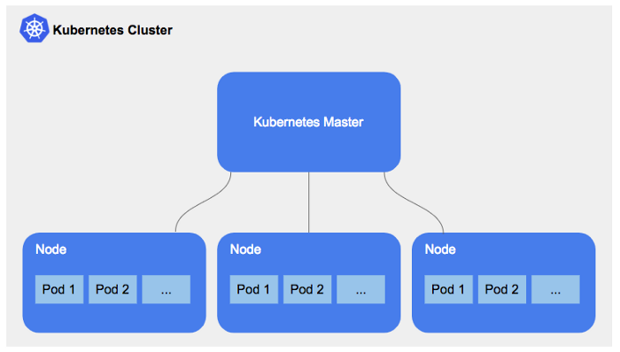
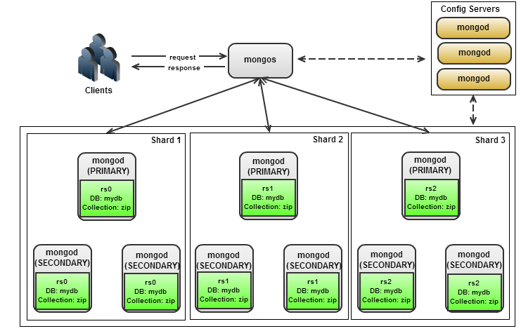

# 테스트용 MongoDB Shard 구성


## Kubernetes Kind로 클러스터 구성

> worker node 3개로 구성되어 있으며, local에서 접속하기 위한 31017 포트 매핑

<p align="center">
  
</p>

- 클러스터 생성
```
$ kind create cluster --config cluster-config.yaml --name mongodb
```

- 클러스터 삭제
```
$ kind delete cluster --name mongodb
```


## MongoDB Shard

<p align="center">
  
</p>

- Shard 구성

```
$ sh setup.sh
```

```
statefulset.apps/mongocfg created
service/mongocfg-svc created
Waiting config containers
mongocfg-0   0/1     Pending   0          0s
...
mongocfg-0   0/1     ContainerCreating   0          2s

---------------------------------------------------
Initializing config
rs.initiate({ _id : "cfgrs", configsvr: true, members: [{ _id : 0, host : "mongocfg-0.mongocfg-svc.default.svc.cluster.local:27017" },{ _id : 1, host : "mongocfg-1.mongocfg-svc.default.svc.cluster.local:27017" },{ _id : 2, host : "mongocfg-2.mongocfg-svc.default.svc.cluster.local:27017" }]})
MongoDB shell version v4.2.14
connecting to: mongodb://127.0.0.1:27017/?compressors=disabled&gssapiServiceName=mongodb
Implicit session: session { "id" : UUID("41f73669-4b28-4935-a312-c0ca91569b24") }
MongoDB server version: 4.2.14
{
        "ok" : 1,
        "$gleStats" : {
                "lastOpTime" : Timestamp(1621086048, 1),
                "electionId" : ObjectId("000000000000000000000000")
        },
        "lastCommittedOpTime" : Timestamp(0, 0)
}
statefulset.apps/mongosh0 created
service/mongosh0-svc created
statefulset.apps/mongosh1 created
service/mongosh1-svc created
statefulset.apps/mongosh2 created
service/mongosh2-svc created
Waiting shard containers
mongosh0-0   0/1     Pending   0          0s
mongosh1-0   0/1     Pending   0          0s
mongosh2-0   0/1     Pending   0          0s
...

---------------------------------------------------
Initializing mongodb sh0
rs.initiate({ _id : "rs0", members: [{ _id : 0, host : "mongosh0-0.mongosh0-svc.default.svc.cluster.local:27017" },{ _id : 1, host : "mongosh0-1.mongosh0-svc.default.svc.cluster.local:27017" },{ _id : 2, host : "mongosh0-2.mongosh0-svc.default.svc.cluster.local:27017" }]})
MongoDB shell version v4.2.14
connecting to: mongodb://127.0.0.1:27017/?compressors=disabled&gssapiServiceName=mongodb
Implicit session: session { "id" : UUID("f53b0f21-2348-48c5-84d0-2a0509d2ec25") }
MongoDB server version: 4.2.14
{ "ok" : 1 }

---------------------------------------------------
Initializing mongodb sh1
rs.initiate({ _id : "rs1", members: [{ _id : 0, host : "mongosh1-0.mongosh1-svc.default.svc.cluster.local:27017" },{ _id : 1, host : "mongosh1-1.mongosh1-svc.default.svc.cluster.local:27017" },{ _id : 2, host : "mongosh1-2.mongosh1-svc.default.svc.cluster.local:27017" }]})
MongoDB shell version v4.2.14
connecting to: mongodb://127.0.0.1:27017/?compressors=disabled&gssapiServiceName=mongodb
Implicit session: session { "id" : UUID("0f87944f-f14b-44a5-bf71-17a1a17eb6fe") }
MongoDB server version: 4.2.14
{ "ok" : 1 }

---------------------------------------------------
Initializing mongodb sh2
rs.initiate({ _id : "rs2", members: [{ _id : 0, host : "mongosh2-0.mongosh2-svc.default.svc.cluster.local:27017" },{ _id : 1, host : "mongosh2-1.mongosh2-svc.default.svc.cluster.local:27017" },{ _id : 2, host : "mongosh2-2.mongosh2-svc.default.svc.cluster.local:27017" }]})
MongoDB shell version v4.2.14
connecting to: mongodb://127.0.0.1:27017/?compressors=disabled&gssapiServiceName=mongodb
Implicit session: session { "id" : UUID("0e13c0a5-0dbf-4e0f-b76a-334e5327effe") }
MongoDB server version: 4.2.14
{ "ok" : 1 }

---------------------------------------------------
configDB to mongos
statefulset.apps/mongos created
service/mongos-svc-ext created
Waiting mongos containers
mongos-0     0/1     Pending   0          0s
...

---------------------------------------------------
Adding shard 0 to router
sh.addShard("rs0/mongosh0-0.mongosh0-svc.default.svc.cluster.local:27017,mongosh0-1.mongosh0-svc.default.svc.cluster.local:27017,mongosh0-2.mongosh0-svc.default.svc.cluster.local:27017")
MongoDB shell version v4.2.14
connecting to: mongodb://127.0.0.1:27017/?compressors=disabled&gssapiServiceName=mongodb
Implicit session: session { "id" : UUID("128fedf5-9a03-4097-bdba-f6a409aa9c71") }
MongoDB server version: 4.2.14
{
        "shardAdded" : "rs0",
        "ok" : 1,
        "operationTime" : Timestamp(1621086081, 7),
        "$clusterTime" : {
                "clusterTime" : Timestamp(1621086081, 7),
                "signature" : {
                        "hash" : BinData(0,"AAAAAAAAAAAAAAAAAAAAAAAAAAA="),
                        "keyId" : NumberLong(0)
                }
        }
}
---------------------------------------------------
Adding shard 1 to router
sh.addShard("rs1/mongosh1-0.mongosh1-svc.default.svc.cluster.local:27017,mongosh1-1.mongosh1-svc.default.svc.cluster.local:27017,mongosh1-2.mongosh1-svc.default.svc.cluster.local:27017")
MongoDB shell version v4.2.14
connecting to: mongodb://127.0.0.1:27017/?compressors=disabled&gssapiServiceName=mongodb
Implicit session: session { "id" : UUID("5d246d58-76b6-4241-ba1f-5f10d93c604f") }
MongoDB server version: 4.2.14
{
        "shardAdded" : "rs1",
        "ok" : 1,
        "operationTime" : Timestamp(1621086081, 12),
        "$clusterTime" : {
                "clusterTime" : Timestamp(1621086081, 12),
                "signature" : {
                        "hash" : BinData(0,"AAAAAAAAAAAAAAAAAAAAAAAAAAA="),
                        "keyId" : NumberLong(0)
                }
        }
}
---------------------------------------------------
Adding shard 2 to router
sh.addShard("rs2/mongosh2-0.mongosh2-svc.default.svc.cluster.local:27017,mongosh2-1.mongosh2-svc.default.svc.cluster.local:27017,mongosh2-2.mongosh2-svc.default.svc.cluster.local:27017")
MongoDB shell version v4.2.14
connecting to: mongodb://127.0.0.1:27017/?compressors=disabled&gssapiServiceName=mongodb
Implicit session: session { "id" : UUID("d5649953-9f71-43a6-9b9c-8aae958171cd") }
MongoDB server version: 4.2.14
{
        "shardAdded" : "rs2",
        "ok" : 1,
        "operationTime" : Timestamp(1621086081, 17),
        "$clusterTime" : {
                "clusterTime" : Timestamp(1621086081, 17),
                "signature" : {
                        "hash" : BinData(0,"AAAAAAAAAAAAAAAAAAAAAAAAAAA="),
                        "keyId" : NumberLong(0)
                }
        }
}
mongodb shard done!!!
```

```
$ kubectl get all
NAME             READY   STATUS    RESTARTS   AGE
pod/mongocfg-0   1/1     Running   0          59s
pod/mongocfg-1   1/1     Running   0          55s
pod/mongocfg-2   1/1     Running   0          51s
pod/mongos-0     1/1     Running   0          22s
pod/mongosh0-0   1/1     Running   0          44s
pod/mongosh0-1   1/1     Running   0          38s
pod/mongosh0-2   1/1     Running   0          32s
pod/mongosh1-0   1/1     Running   0          44s
pod/mongosh1-1   1/1     Running   0          39s
pod/mongosh1-2   1/1     Running   0          33s
pod/mongosh2-0   1/1     Running   0          44s
pod/mongosh2-1   1/1     Running   0          39s
pod/mongosh2-2   1/1     Running   0          32s

NAME                     TYPE        CLUSTER-IP    EXTERNAL-IP   PORT(S)           AGE
service/kubernetes       ClusterIP   10.96.0.1     <none>        443/TCP           37m
service/mongocfg-svc     ClusterIP   None          <none>        27017/TCP         59s
service/mongos-svc-ext   NodePort    10.96.21.17   <none>        27017:31017/TCP   22s
service/mongosh0-svc     ClusterIP   None          <none>        27017/TCP         44s
service/mongosh1-svc     ClusterIP   None          <none>        27017/TCP         44s
service/mongosh2-svc     ClusterIP   None          <none>        27017/TCP         44s

NAME                        READY   AGE
statefulset.apps/mongocfg   3/3     59s
statefulset.apps/mongos     1/1     22s
statefulset.apps/mongosh0   3/3     44s
statefulset.apps/mongosh1   3/3     44s
statefulset.apps/mongosh2   3/3     44s
```

- Shard 접속

```
$ mongo --host localhost:31017
MongoDB shell version v4.2.0
connecting to: mongodb://localhost:31017/?compressors=disabled&gssapiServiceName=mongodb
Implicit session: session { "id" : UUID("f0fa973e-088f-49d8-b149-7c2c4581a710") }
MongoDB server version: 4.2.14
Server has startup warnings:
2021-05-15T13:53:38.275+0000 I  CONTROL  [main]
2021-05-15T13:53:38.275+0000 I  CONTROL  [main] ** WARNING: Access control is not enabled for the database.
2021-05-15T13:53:38.275+0000 I  CONTROL  [main] **          Read and write access to data and configuration is unrestricted.
2021-05-15T13:53:38.275+0000 I  CONTROL  [main] ** WARNING: You are running this process as the root user, which is not recommended.
2021-05-15T13:53:38.275+0000 I  CONTROL  [main]
mongos> sh.status()
--- Sharding Status ---
  sharding version: {
  	"_id" : 1,
  	"minCompatibleVersion" : 5,
  	"currentVersion" : 6,
  	"clusterId" : ObjectId("609fd2545de4118f3628f57a")
  }
  shards:
        {  "_id" : "rs0",  "host" : "rs0/mongosh0-0.mongosh0-svc.default.svc.cluster.local:27017,mongosh0-1.mongosh0-svc.default.svc.cluster.local:27017,mongosh0-2.mongosh0-svc.default.svc.cluster.local:27017",  "state" : 1 }
        {  "_id" : "rs1",  "host" : "rs1/mongosh1-0.mongosh1-svc.default.svc.cluster.local:27017,mongosh1-1.mongosh1-svc.default.svc.cluster.local:27017,mongosh1-2.mongosh1-svc.default.svc.cluster.local:27017",  "state" : 1 }
        {  "_id" : "rs2",  "host" : "rs2/mongosh2-0.mongosh2-svc.default.svc.cluster.local:27017,mongosh2-1.mongosh2-svc.default.svc.cluster.local:27017,mongosh2-2.mongosh2-svc.default.svc.cluster.local:27017",  "state" : 1 }
  active mongoses:
        "4.2.14" : 1
  autosplit:
        Currently enabled: yes
  balancer:
        Currently enabled:  yes
        Currently running:  no
        Failed balancer rounds in last 5 attempts:  0
        Migration Results for the last 24 hours:
                No recent migrations
  databases:
        {  "_id" : "config",  "primary" : "config",  "partitioned" : true }
```

- Shard 삭제

```
$ sh clean.sh
```

```
Deleting config nodes
statefulset.apps "mongocfg" deleted
service "mongocfg-svc" deleted
Waiting the following containers:
mongocfg-0   1/1     Terminating   0          2m16s
mongocfg-1   1/1     Terminating   0          2m13s
mongocfg-2   0/1     Terminating   0          2m9s
...

Deleting config pvc
persistentvolumeclaim "data-mongocfg-0" deleted
persistentvolumeclaim "data-mongocfg-1" deleted
persistentvolumeclaim "data-mongocfg-2" deleted

Deleting shard nodes
statefulset.apps "mongosh0" deleted
service "mongosh0-svc" deleted
statefulset.apps "mongosh1" deleted
service "mongosh1-svc" deleted
statefulset.apps "mongosh2" deleted
service "mongosh2-svc" deleted
Waiting shard containers
mongosh0-0   1/1     Terminating   0          2m10s
mongosh0-1   1/1     Terminating   0          2m6s
mongosh0-2   1/1     Terminating   0          2m
mongosh1-0   1/1     Terminating   0          2m10s
mongosh1-1   1/1     Terminating   0          2m6s
mongosh1-2   1/1     Terminating   0          2m
mongosh2-0   1/1     Terminating   0          2m10s
mongosh2-1   1/1     Terminating   0          2m4s
mongosh2-2   1/1     Terminating   0          118s
...

Deleting shard 1,2,3 pvc
persistentvolumeclaim "data-mongosh0-0" deleted
persistentvolumeclaim "data-mongosh0-1" deleted
persistentvolumeclaim "data-mongosh0-2" deleted
persistentvolumeclaim "data-mongosh1-0" deleted
persistentvolumeclaim "data-mongosh1-1" deleted
persistentvolumeclaim "data-mongosh1-2" deleted
persistentvolumeclaim "data-mongosh2-0" deleted
persistentvolumeclaim "data-mongosh2-1" deleted
persistentvolumeclaim "data-mongosh2-2" deleted

Deleting mongos nodes
statefulset.apps "mongos" deleted
service "mongos-svc-ext" deleted
Waiting the following containers:
mongos-0   0/1     Terminating   0          2m34s
...

No resources found in default namespace.
persistentvolumeclaim "data-mongos-0" deleted
```